# Chess
# 棋盘表示 
棋盘表示主要探讨的是使用什么数据结构来表示棋盘上的信息。一般说来,这与具体的棋类知识密切相关。通常,用来描述棋盘及其上棋子信息的是一个二维数组。例如,可以用一个9x10个字节的二维数组来表示中国象棋的棋盘,数组中每一个字节代表棋盘上的一个交点,其值表明这个交点上放置的是一个什么棋子或是没有棋子;也可以用 19x19个字节的二维数组来表示围棋的棋盘,在其上用值为0的字节表示该点空白,1表示该点有一个黑棋,2表示该点有一个白棋

设计一种数据结构来表示一种棋类游戏的状态往往要考虑3个方面的问题:
- 占用的空间数量 
- 操作速度 
- 使用方便与否

在早期的博弈编程中,由于内存极其有限,一些程序采用了极为紧凑的数据结构来表示棋盘上的信息。例如,中国象棋共有14种不同的棋子,红黑各7种,所以棋盘上1个交点的状态最多只能有15种,停放某种棋子或者空白。基于这种思想,显然可以用4位来表示一个交点。 也就是说,可以用一个字节来表示两个交点。这样表示整个棋盘的信息就只需要一个9x5个字节的二维数组了。可以让每个字节的高4位代表奇数行的交点,让低4位代表偶数行的交点。一个棋盘状态总共需要45个字节来表示。
如果从棋子的观点出发,将棋盘看作是一个平面坐标系,可以看出每一个棋子的位置信息,包含一个小于10的横坐标和一个小于11的纵坐标。显然,我们使用一个有32个字节的一维数组就可以表示所有32个棋子的位置,每个字节的高4位表示该棋子的横坐标,低4位表示该棋子的纵坐标。已被吃掉的棋子用一个坐标范围以外的数表示。这样整个棋盘上的信息就被装进了这32个字节当中。

本程序中使用的方法就是类似后者 用一个结构体数组来表示每个棋子的状态
- 黑棋1-7
- 红棋8-14

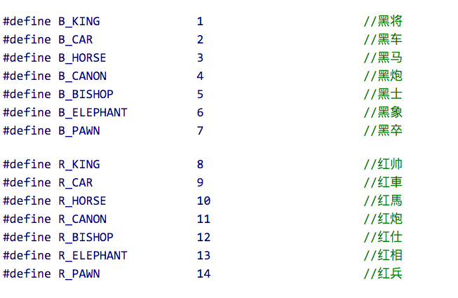

- 定义每个坐标上的棋子

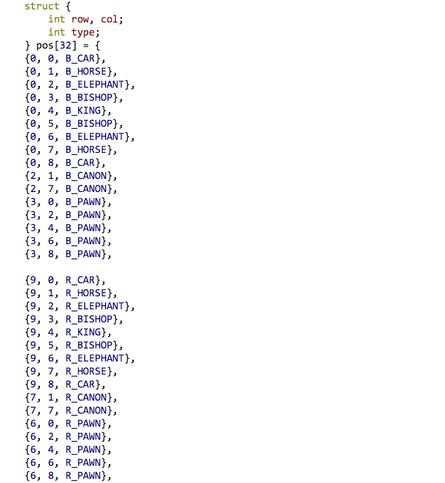

- 对应的文字

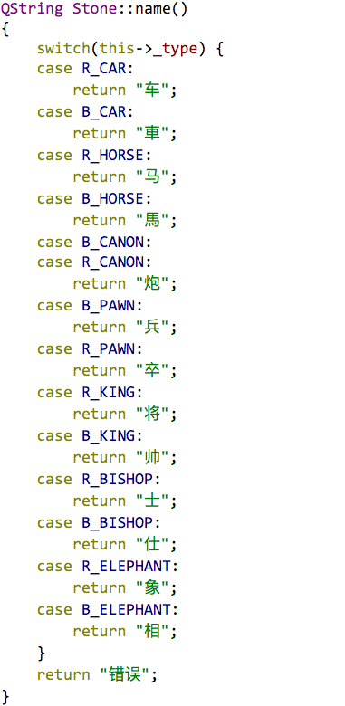

- 绘制棋盘函数

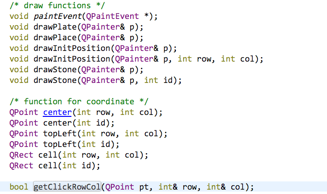
# 走法产生
走法产生是指将一个局面的所有可能的走法罗列出来的那一部分程序。也就是用来告诉其他部分下一步可以往哪里走的模块。各种棋类随规则的不同,走法产生的复杂程度也有很大的区别。例如,五子棋的棋盘上的任意空白点都是合法的下一步。这样在五子棋的走法产生模块里,只要扫描棋盘,寻找到所有的空白,就可以罗列出所有符合规则的下一步;而在象棋里,你就要仔细判断。比如象只可以走田字,你就需检查与这个象相关联的象位上是否有自己的棋,并且要检查其间的象眼上是否有棋子;而兵则要注意是不可后退并一次只能前进一步。

以中国象棋为例,假定现在有一个轮到红方走棋的局面。要列举出红方所有合乎规则的走法。
首先要扫描棋盘。如果某一个位置上是一个红方棋子,则根据该棋子的类型找出该棋子的所有可走位。例如该棋子是马,检查马的纵横和横纵方向上的距离分别为1和2的所有位置是否有红方棋子,如某位置没有,则还要检查该方向上与马的横纵距离均为1的位置是否有棋子。如没有,该位置就是前述红马的一个合法走步。其他的棋子也要经历各自的判断程序最后找出所有合法的走步。
- 走法产生

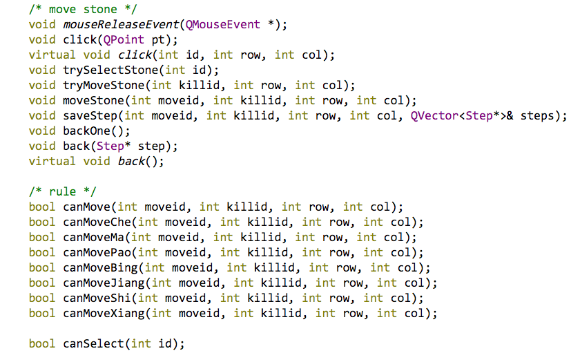
# 基本搜索算法
在通常的棋局当中,一个局面的评估往往并不像输、赢、平3种状态这么简单,在分不出输赢的局面中棋局也有优劣之分。也就是说,要用更细致的方法来刻画局面的优劣,而不是仅仅使用1、-1、0三个数字刻画3种终了局面。假定我们有一个函数可以为每一局面的优劣评分。例如甲胜为+∞;乙胜为-∞;和局为0;其他的情形依据双方剩余棋子的数量及位置评-∞ ~ +∞之间的具体分数。这样我们可以建立一棵固定深度的搜索树,其叶子节点不必是终了状态,而只是固定深度的最深一层的节点,其值由上述函数评出;对于中间节点,如同前面提到的那样,甲方取子节点的最大值,乙方取子节点的最小值。这个评分的函数称作静态估值函数。用以取代超出固定深度的搜索。显然,我们无法拥有绝对精确的静态估值函数。否则,只要这个静态估值函数就可以解决所有的棋局了。估值函数给出的只是一个较粗略的评分,在此基础上进行的少量搜索的可靠性
- 博弈树极大值极小值算法

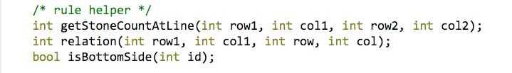

- 选项

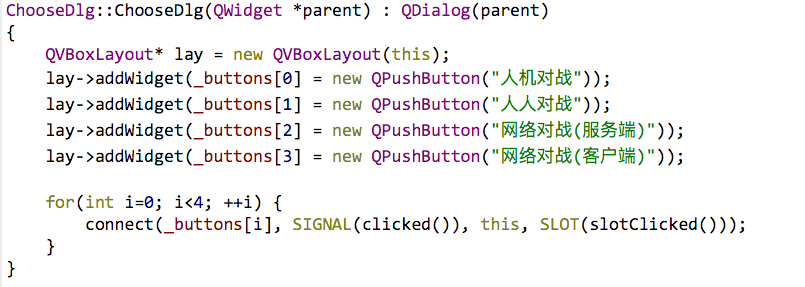

- 按值绘制窗口

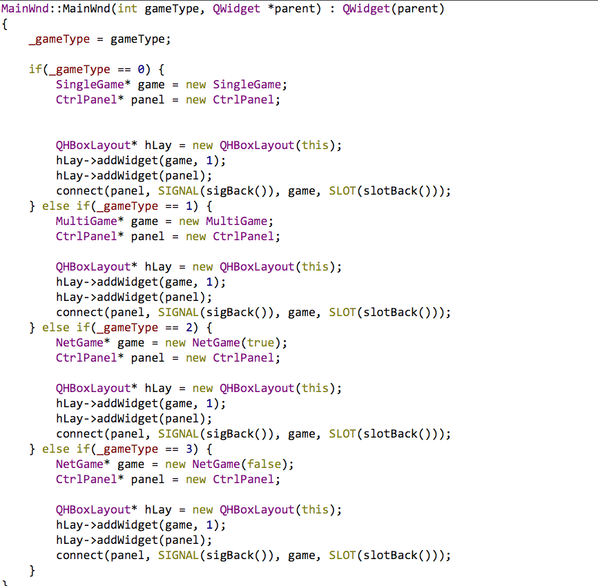

- 网络服务端与客户端的建立

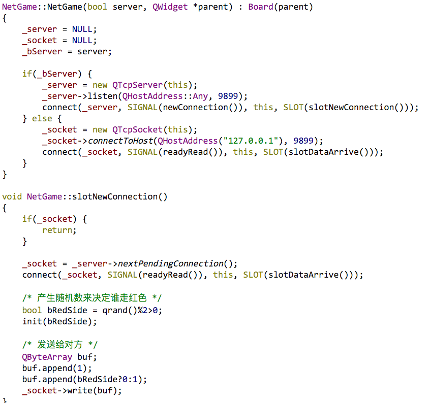
# 价值评估
棋子的价值评估,简单的说就是评估双方都有哪些棋子在棋盘上。根据我们的经验,可以让一个车价值为500,一个马价值为300,一个兵价值为100等等。将的价值为无限大(通常用一个远大于其他棋子的数)。一方的棋子总值就是棋盘上存活的该方棋子乘以棋子价值的和。用一个式子表达:
- SideValue = Sum(PieceNumber x PiceValue)

其中PieceNumbe是某种棋子的数量,PiceValue是该种棋子的价值,Sum是对各种棋子的总价值求和。如果红色的棋子价值总和大于黑色的棋子价值总和,通常这意味着红方的局势优于黑方。而红黑双方的SideValue之差越大,红方的优势也就越大。
- 价值评估

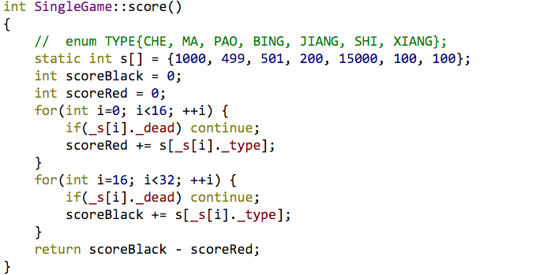
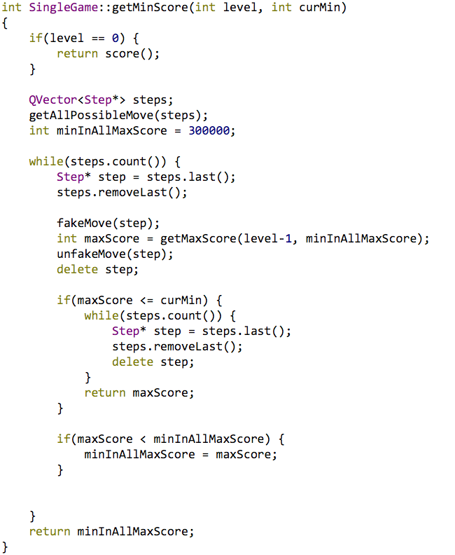
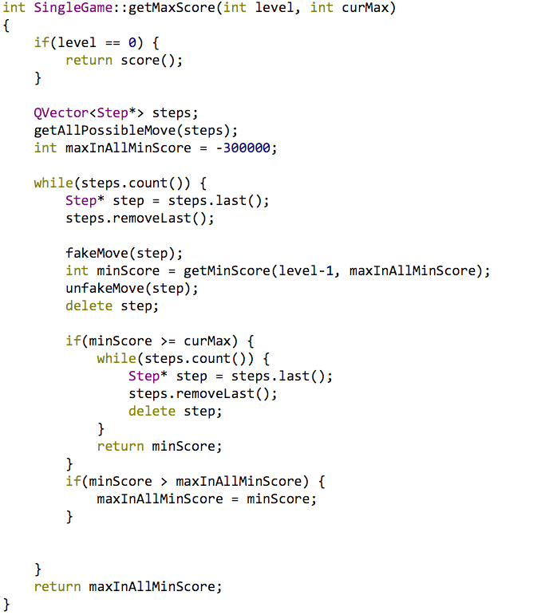

# 棋子的灵活性与棋盘控制
棋子的灵活性是指棋子的活动范围,通常是越大越好。一匹不能动的马很难在棋局中发挥重要作用;同样,一个蹲在角落里的车也是价值不高的。
评估棋子的灵活性较为简单,将一个棋子的所有合法走法罗列出来,乘上该种棋子每一可 走步的价值就行了。套用式子:
- Mobility = Sum(MoveNumber x MoveValue)

其中MoveNumber是某种棋子的合法走法数量，MoveValue是该种棋子每一走法的价值，Sum是对所有的棋子的灵活性价值求和。Mobility就是所有棋子的灵活性分数
与灵活性评估类似,还可以评估博弈双方对棋盘上位置的控制能力。在象棋中,如果一位 置落在某方棋子的合法走步上,就可以认为被该方控制。如果某一位置同时落在双方的合法 走步上,我们可以根据双方控制该位置的棋子数量及棋子价值来决定孰优孰劣。能控制更多 位置的一方应在这项评分上占优。
评估棋盘棋子的灵活性和棋盘控制在各种棋类中的作用大相径庭。一般来说在象棋中这 属于较为次要的内容,但在围棋中可能起极关键的作用。
# 棋子关系的评估
棋子间的关系也是估值的重要内容之一,我们可以将某个棋子被对方棋子威胁看成是一个不利的因素。例如红车的位置在黑马的合法走步当中,此时我们可以把红车的价值减去一个值(例如 200)来刻画这种情形。而如果红马在黑车的合法走步之中,而红马同时也在红卒的合法走步之中,我们可以认为红马置于红卒的保护之下,没有受到威胁,价值不变。
棋子关系的评估应考虑到该谁走棋的问题。如果某个红马落在黑炮的合法走步之内,但此时轮到红方走棋,应认为红马受到的威胁较轻。而如果此时轮到黑方走棋,就应认为红马受到的威胁很大,应减去一个相对较大的值了。如果将被对方威胁,且轮到对方走棋,那么无论有何种棋子可以走到将位都没有意义,将等于失去了。此时应结束估值返回失败的估值

# 程序界面

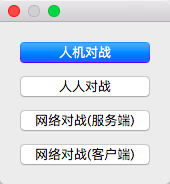
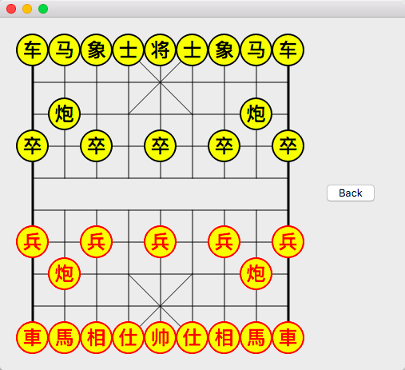

# 网络对战

- 左侧为服务端 右侧为客户端
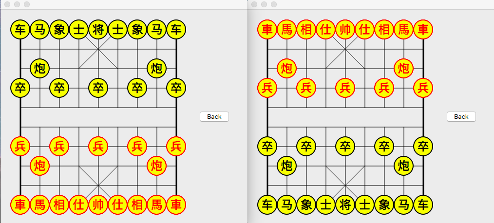

